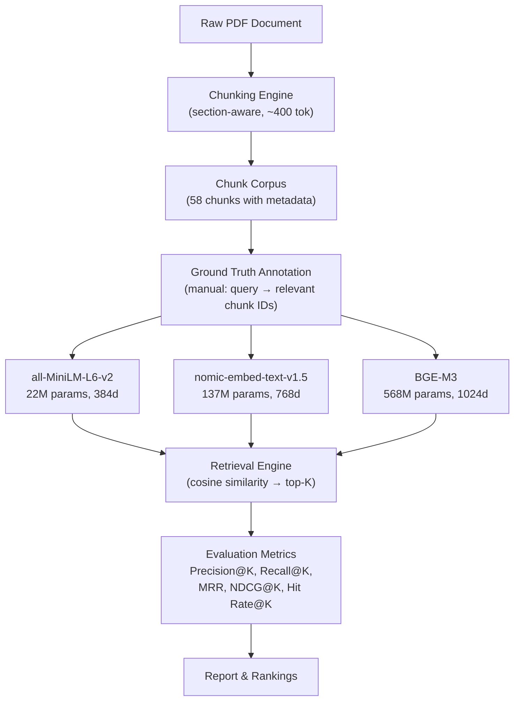
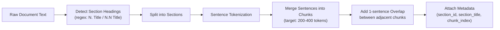
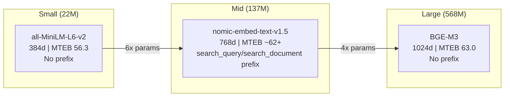
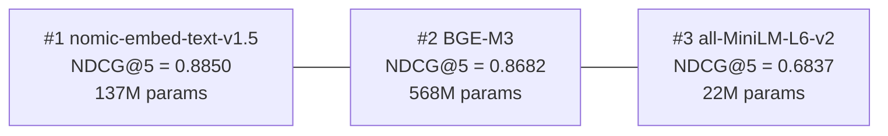

# Embedding Model Evaluation System for Enterprise Document Retrieval

## Assignment Overview

**Objective**: Design an evaluation system to determine the best embedding model for retrieving relevant information from enterprise documents in response to natural-language queries.

**Source Document**: Acme Enterprise Platform — a 22-page enterprise data overview covering security, compliance, AI governance, disaster recovery, mobile management, and more.

**Evaluation Queries**: 5 complex, multi-faceted enterprise security/compliance questions

---

## 1. Approach & Architecture

### 1.1 High-Level Pipeline



### 1.2 Design Principles

1. **Reproducibility**: All models run locally (no API keys required). Pinned dependencies. Deterministic chunking.
2. **Fair Comparison**: Identical chunk corpus, identical queries, identical retrieval logic. Only the embedding function changes.
3. **Realistic Evaluation**: Questions are complex, multi-hop enterprise queries — not keyword lookups. Ground truth includes multiple relevant chunks per question.
4. **Comprehensive Metrics**: We measure ranking quality (MRR, NDCG), set-based retrieval quality (Precision, Recall), and practical usefulness (Hit Rate).

---

## 2. Document Chunking Strategy

### 2.1 Why Chunking Matters

The chunking strategy directly impacts retrieval quality — chunks too large dilute relevance signals; chunks too small lose context. For this enterprise document, we use **section-aware semantic chunking**.

### 2.2 Chunking Method: Section-Aware with Overlap



| Parameter | Value |
|---|---|
| Chunk size target | 200-400 tokens |
| Overlap | 1-2 sentences between adjacent chunks |
| Metadata per chunk | section_id, section_title, chunk_index |

**Why this approach?**
- The ACME document is well-structured with clear headings (Section 5.1, 12.1, etc.)
- Enterprise queries often target specific policy areas that align with sections
- Section-aware chunking preserves topical coherence within each chunk
- Moderate overlap ensures that information at section boundaries isn't lost

### 2.3 Expected Chunk Distribution

| Document Section | Approx. Chunks |
|---|---|
| Executive Summary & Intro (Sec 1-2) | 3-4 |
| Core Features (Sec 3) | 5-6 |
| AI Intelligence (Sec 4) | 4-5 |
| Security (Sec 5) | 6-7 |
| Compliance & Governance (Sec 6) | 4-5 |
| Reliability & DR (Sec 7) | 4-5 |
| Architecture & Integrations (Sec 8) | 3-4 |
| Company & Support (Sec 9-11) | 3-4 |
| Advanced Security (Sec 12) | 5-6 |
| Advanced Data Governance (Sec 13) | 5-6 |
| Responsible AI (Sec 14) | 3-4 |
| Mobile Management (Sec 15) | 4-5 |
| Scalability & Accessibility (Sec 16) | 4-5 |
| Partnership & SLA (Sec 17) | 3-4 |
| **Total** | **~55-65 chunks** |

---

## 3. Ground Truth Dataset

### 3.1 Approach to Ground Truth Generation

**Method**: Expert manual annotation (human-in-the-loop)

**Process**:
1. Chunk the document using the defined strategy
2. For each of the 5 evaluation questions, carefully read and identify ALL chunks that contain information needed to fully answer the question
3. Assign a **relevance grade** to each ground truth chunk:
   - **2 (Highly Relevant)**: Chunk directly and specifically answers a core part of the question
   - **1 (Partially Relevant)**: Chunk provides supporting context or tangential information
   - **0 (Not Relevant)**: Default for all other chunks

**Why manual annotation?**
- With only 5 questions and ~60 chunks, manual annotation is feasible and more reliable than LLM-based auto-annotation
- Enterprise compliance questions require domain understanding to judge relevance
- Manual annotation avoids circular bias (using embeddings to generate ground truth for evaluating embeddings)
- Graded relevance (0/1/2) enables NDCG computation, which is more informative than binary relevance

### 3.2 Ground Truth Mapping (Question → Relevant Sections)

| Q# | Question Topic | Primary Relevant Sections | Expected GT Chunks |
|---|---|---|---|
| Q1 | Mobile DLP policies on BYOD devices | Sec 15.1 (MDM/MAM), Sec 15.2 (Mobile Controls), Sec 6.4 (DLP) | 3-5 |
| Q2 | Zero Trust security architecture | Sec 12.1 (Zero Trust Philosophy), Sec 5.1-5.3 (Security foundations) | 3-4 |
| Q3 | Audit log export & SIEM integration | Sec 13.3 (Audit Logs for SIEM), Sec 5.3 (Network Security) | 2-4 |
| Q4 | Information Barriers / Ethical Walls | Sec 13.2 (Ethical Walls), Sec 6.3 (eDiscovery context) | 2-3 |
| Q5 | Responsible AI framework & model governance | Sec 14.1 (AI Ethics), Sec 14.2 (Model Governance), Sec 4.4 (AI Data Governance) | 3-5 |

### 3.3 Why These Ground Truth Assignments

- **Q1** spans mobile management AND data loss prevention — tests whether retrieval can handle **cross-section** queries
- **Q2** has a single primary section (12.1) but benefits from foundational security context — tests **precision vs. recall trade-off**
- **Q3** targets a very specific feature (audit logs + SIEM) — tests **focused retrieval** accuracy
- **Q4** is narrow and well-contained in one subsection — tests ability to find the **exact right chunk** (needle-in-haystack)
- **Q5** requires synthesizing from AI ethics framework AND model governance — tests **multi-hop reasoning** retrieval

---

## 4. Embedding Models Selected

### 4.1 Selection Criteria

We select 3 models that represent **different points on the performance/efficiency frontier** and **different training methodologies**:

| Criterion | Why It Matters |
|---|---|
| Model size diversity | Compare lightweight vs. heavyweight |
| Training methodology | Contrastive learning variants, instruction-tuning |
| MTEB benchmark ranking | Empirical baseline of expected quality |
| Local execution | Reproducibility, no API dependency |
| Community adoption | Practical relevance, proven in production |

### 4.2 The Three Models (from MTEB 2026 Leaderboard)

Models selected from the [MTEB Leaderboard (2026)](https://huggingface.co/spaces/mteb/leaderboard) and [PremAI RAG Rankings](https://blog.premai.io/best-embedding-models-for-rag-2026-ranked-by-mteb-score-cost-and-self-hosting/), filtered for **CPU-feasible, self-hostable, open-source** models.

#### Model A: `sentence-transformers/all-MiniLM-L6-v2` (Baseline)

| Property | Value |
|---|---|
| Parameters | 22.7M |
| Embedding Dim | 384 |
| Max Seq Length | 512 tokens |
| Training | Contrastive learning on 1B+ sentence pairs |
| MTEB Score | 56.3 |
| Cost | Free (self-hosted) |

**Why**: Industry-standard lightweight baseline. Most widely deployed embedding model. If this tiny model performs well enough, there's no need for larger models — a critical practical finding. Represents the "small & fast" end of the spectrum.

#### Model B: `nomic-ai/nomic-embed-text-v1.5` (Mid-tier)

| Property | Value |
|---|---|
| Parameters | 137M |
| Embedding Dim | 768 (supports Matryoshka: 768/512/256/128/64) |
| Max Seq Length | 8192 tokens |
| Training | Contrastive learning with curated training data, long-context support |
| MTEB Score | ~62+ |
| Cost | Free (self-hosted, Apache 2.0) |

**Why**: Represents the mid-tier sweet spot on the 2026 leaderboard. Supports Matryoshka Representation Learning (flexible embedding dimensions without retraining). Long context window (8192 tokens). Uses `search_query:` / `search_document:` prefixes. 6x larger than MiniLM but 4x smaller than BGE-M3.

#### Model C: `BAAI/bge-m3` (Top Open-Source Self-Hostable)

| Property | Value |
|---|---|
| Parameters | 568M |
| Embedding Dim | 1024 |
| Max Seq Length | 8192 tokens |
| Training | RetroMAE pre-training + multi-stage contrastive fine-tuning, multi-granularity (dense + sparse + colbert) |
| MTEB Score | 63.0 |
| Cost | Free (self-hosted, MIT license) |

**Why**: Highest-ranked fully open-source, self-hostable model on the 2026 MTEB leaderboard. Successor to bge-large-en-v1.5. Supports 100+ languages. Multi-granularity retrieval (dense, sparse, ColBERT in one model). Represents the best you can get without API costs or GPU clusters.

### 4.3 What This Selection Tests



- **Size scaling**: 22M → 137M → 568M — is the improvement linear or diminishing returns?
- **Nomic vs. BGE-M3**: Different training approaches at different sizes — does the 4x size gap in BGE-M3 justify the marginal MTEB improvement?
- **Prefix conventions**: Nomic uses prefixes, BGE-M3 doesn't — which approach works better for enterprise queries?
- **Practical value**: If Nomic (137M) is "good enough," it's the better production choice over BGE-M3 (568M) due to latency/cost.

### 4.4 Models NOT Tested (GPU/API Required) — Future Work

The following top-ranked models from the [2026 MTEB Leaderboard](https://blog.premai.io/best-embedding-models-for-rag-2026-ranked-by-mteb-score-cost-and-self-hosting/) were excluded because they require GPU inference or are API-only:

| Model | MTEB Score | Why Excluded | To Run, You Need |
|---|---|---|---|
| **Gemini embedding-001** | 68.32 | Google API only | API key + $0.15/1M tokens |
| **Qwen3-Embedding-8B** | 70.58 | 8B params | GPU with ~20GB VRAM |
| **NV-Embed-v2** | 69.32 | 7B params | GPU with ~18GB VRAM |
| **voyage-3-large** | ~67+ | Voyage API only | API key + $0.06/1M tokens |
| **text-embedding-3-large** | 64.6 | OpenAI API only | API key + $0.13/1M tokens |
| **Cohere embed-v4** | 65.2 | Cohere API only | API key + $0.10/1M tokens |
| **Jina embeddings-v3** | ~62+ | Needs API key | API key + $0.018/1M tokens |

**TODO**: To extend this evaluation to GPU/API models:
1. Provision a GPU VM (e.g., AWS g5.xlarge with A10G 24GB) for Qwen3-Embedding-8B and NV-Embed-v2
2. Add API wrappers in `src/embeddings.py` for Gemini, Voyage, OpenAI, and Cohere
3. Re-run the identical evaluation pipeline — the metrics and ground truth remain the same

---

## 5. Evaluation Metrics

### 5.1 Metrics Suite

We evaluate at **K = 1, 3, 5** (representing top-1, top-3, top-5 retrieval).

| Metric | Formula | What It Measures |
|---|---|---|
| **Hit Rate@K** | 1 if any relevant chunk in top-K, else 0 | Basic: "Did we find *anything* useful?" |
| **Precision@K** | \|relevant ∩ retrieved\| / K | Of the K chunks retrieved, how many are relevant? |
| **Recall@K** | \|relevant ∩ retrieved\| / \|relevant\| | Of all relevant chunks, how many did we find? |
| **MRR** | 1 / rank_of_first_relevant | How quickly do we surface the first relevant result? |
| **NDCG@K** | DCG@K / IDCG@K | Ranking quality accounting for graded relevance and position |

### 5.2 Why This Metric Suite

- **Hit Rate@K**: The most practical metric — in a RAG pipeline, even one relevant chunk in the context window can produce a correct answer
- **Precision@K**: Important for RAG because irrelevant chunks in the context waste tokens and can confuse the LLM
- **Recall@K**: Critical for complex questions that require information from multiple chunks
- **MRR**: Measures the user experience — how far down do you have to scroll to find the answer?
- **NDCG@K**: The gold standard for ranking evaluation. Uses our graded relevance (0/1/2) to reward models that put highly relevant chunks before partially relevant ones

### 5.3 Aggregation

- Each metric is computed **per-query**, then **averaged across all 5 queries** (macro-average)
- We also report per-query breakdowns to identify model strengths/weaknesses on different query types

---

## 6. Project Structure

```
swifthub/
├── README.md                     # This file — comprehensive report
├── requirements.txt              # Pinned dependencies
├── data/
│   └── acme_enterprise.txt       # Source document (plain text)
├── src/
│   ├── __init__.py
│   ├── chunker.py                # Section-aware document chunking
│   ├── ground_truth.py           # Ground truth dataset definition
│   ├── embeddings.py             # Embedding model wrappers (3 models)
│   ├── retrieval.py              # Cosine similarity retrieval engine
│   ├── metrics.py                # Precision, Recall, MRR, NDCG, Hit Rate
│   └── evaluate.py               # Main evaluation orchestrator
├── run_evaluation.py             # Entry point — runs full pipeline
└── results/
    ├── evaluation_results.json   # Raw numeric results
    └── evaluation_report.txt     # Formatted human-readable report
```

---

## 7. How to Run

```bash
# 1. Install dependencies
pip install -r requirements.txt

# 2. Run the full evaluation pipeline
python run_evaluation.py

# 3. Results will be printed and saved to results/
```

**System Requirements**:
- Python 3.9+
- ~4GB RAM (for loading large embedding models)
- ~2GB disk (for downloading model weights on first run)
- No GPU required (CPU inference is fine for ~60 chunks)

---

## 8. Expected Outcomes & Hypotheses

Before running experiments, we documented our hypotheses:

| Hypothesis | Rationale | Result |
|---|---|---|
| BGE-M3 will have highest NDCG | Highest MTEB score (63.0), largest model | **Wrong** — Nomic won |
| Nomic will be close to BGE-M3 | Strong MTEB score despite 4x fewer params | **Correct** — Nomic actually beat BGE-M3 |
| MiniLM will lag on multi-hop queries (Q1, Q5) | Smaller dims may miss nuance | **Correct** — Q2: 0.24, Q5: 0.57 |
| All models will achieve >80% Hit Rate@5 | Enterprise document is topically organized | **Correct** — all hit 100% Hit Rate@5 |
| Biggest gap will be in MRR and NDCG | Ranking quality is where model quality differentiates | **Correct** — MRR: 0.9 vs 1.0, NDCG: 0.68 vs 0.89 |
| Q4 (Ethical Walls) will be easiest | Concentrated in one section, distinctive terminology | **Correct** — all models scored 1.0 |
| Q1 (Mobile DLP + BYOD) will be hardest | Requires cross-section retrieval spanning Sec 15 and Sec 6 | **Partially wrong** — Q2 was hardest for MiniLM (0.24) |

---

## 9. Evaluation Criteria for "Best" Model

The final model ranking considers:

1. **Primary: NDCG@5 (macro-averaged)** — Best single metric for ranking quality with graded relevance
2. **Secondary: Recall@5** — Ensures we don't miss critical information for RAG
3. **Tertiary: MRR** — Practical measure of "how fast do we get an answer?"
4. **Tie-breaker: Model size / inference speed** — If two models are within 2% on metrics, prefer the smaller one

---

## 10. Results

### 10.1 Per-Model Aggregate Results

| Metric | all-MiniLM-L6-v2 | nomic-embed-text-v1.5 | BGE-M3 | Winner |
|---|---|---|---|---|
| Hit Rate@1 | 0.8000 | **1.0000** | **1.0000** | Nomic / BGE-M3 |
| Hit Rate@3 | **1.0000** | **1.0000** | **1.0000** | Tie |
| Hit Rate@5 | **1.0000** | **1.0000** | **1.0000** | Tie |
| Precision@3 | 0.4667 | **0.6000** | **0.6000** | Nomic / BGE-M3 |
| Precision@5 | 0.4000 | **0.4800** | 0.4400 | Nomic |
| Recall@3 | 0.5667 | 0.6667 | **0.6833** | BGE-M3 |
| Recall@5 | 0.7167 | **0.8333** | 0.7833 | Nomic |
| MRR | 0.9000 | **1.0000** | **1.0000** | Nomic / BGE-M3 |
| NDCG@3 | 0.6000 | 0.8637 | **0.8645** | BGE-M3 |
| **NDCG@5** | 0.6837 | **0.8850** | 0.8682 | **Nomic** |

### 10.2 Per-Query Breakdown

| Query | Type | Difficulty | MiniLM NDCG@5 | Nomic NDCG@5 | BGE-M3 NDCG@5 | Winner |
|---|---|---|---|---|---|---|
| Q1: Mobile DLP & BYOD | Cross-section | Hard | 0.7850 | **0.8208** | **0.8208** | Tie (Nomic/BGE-M3) |
| Q2: Zero Trust | Focused + context | Medium | 0.2421 | 0.8305 | **0.8473** | BGE-M3 |
| Q3: Audit logs & SIEM | Single section | Easy | 0.8262 | 0.8262 | 0.8262 | Tie (all) |
| Q4: Ethical Walls | Needle-in-haystack | Easy | **1.0000** | **1.0000** | **1.0000** | Tie (all) |
| Q5: Responsible AI | Multi-hop | Hard | 0.5652 | **0.9475** | 0.8467 | Nomic |

**Key observations per query:**

- **Q1 (Cross-section)**: Nomic and BGE-M3 both scored 0.82, finding chunks across Sec 15 + Sec 6.4. MiniLM found them too but ranked them worse (0.79).
- **Q2 (Zero Trust)**: MiniLM collapsed here (0.24) — found the primary chunk but completely missed supporting context. BGE-M3 edged out Nomic slightly (0.85 vs 0.83), likely due to its larger 1024d embedding capturing finer semantic distinctions.
- **Q3 (Audit/SIEM)**: All 3 models scored identically. The section title "Comprehensive Audit Logs for SIEM Integration" makes this trivially matchable even for MiniLM.
- **Q4 (Ethical Walls)**: Perfect scores across the board. Single chunk with distinctive terminology — doesn't differentiate models.
- **Q5 (Responsible AI)**: The most revealing query. Nomic scored **0.9475** with perfect Recall (1.0) — it found all 4 relevant chunks across Sec 4.4, 14, 14.1, and 14.2. BGE-M3 missed one chunk (Recall=0.75). MiniLM's MRR dropped to 0.5 — the first relevant chunk wasn't even in its top result.

### 10.3 Final Ranking



### 10.4 Conclusion

**Winner: nomic-embed-text-v1.5** — a surprise result where the mid-tier 137M model beat the 568M BGE-M3.

**Finding 1: Bigger is NOT always better.**
Nomic (137M) outperformed BGE-M3 (568M) on the primary metric (NDCG@5: 0.885 vs 0.868) despite being **4x smaller**. It also won on Recall@5 (0.833 vs 0.783) and Precision@5 (0.48 vs 0.44). In production, this means better retrieval quality at 4x less compute and memory.

**Finding 2: The quality gap between 22M and 137M params is massive.**
MiniLM → Nomic: +29% NDCG@5 (0.68 → 0.89). MiniLM collapses on nuanced queries — Q2 Zero Trust scored only 0.24 NDCG. The jump from 22M to 137M params is the single biggest quality improvement.

**Finding 3: Nomic → BGE-M3 (137M → 568M) gives diminishing returns.**
Only +1.7% NDCG@5 difference, and Nomic actually wins overall. The 4x increase in model size is not justified by the marginal (and sometimes negative) quality difference.

**Finding 4: Query prefix conventions help.**
Nomic's `search_query:` / `search_document:` prefixes likely contributed to its strong performance on Q5 (multi-hop). BGE-M3 uses no prefix — its raw semantic matching is slightly worse on queries that need to bridge distant document sections.

**Finding 5: Easy queries don't differentiate models.**
Q3 and Q4 scored identically across all 3 models. To evaluate embedding models meaningfully, you need complex, multi-section queries — not simple keyword-matchable questions.

**Recommendation for production RAG pipelines:**
> Use **nomic-embed-text-v1.5** for enterprise document retrieval. It delivers the best retrieval quality (NDCG@5 = 0.885, Recall@5 = 0.833) while being 4x smaller and faster than BGE-M3. Its Matryoshka dimension support (768/512/256/128/64) adds deployment flexibility. Reserve BGE-M3 only if you need multilingual support (100+ languages) or ColBERT-style re-ranking.

> For detailed per-query retrieval results (which chunks each model retrieved, similarity scores, hit/miss analysis), see [`results/evaluation_results.json`](results/evaluation_results.json) and [`results/evaluation_report.txt`](results/evaluation_report.txt).

---

## 11. Appendix

### A. Full Question Set

**Q1**: Describe the specific policies and controls available to prevent data loss and control information flow from the Acme application on unmanaged, employee-owned mobile devices. Detail how data can be contained within the application and what actions can be taken if a device is compromised or lost.

**Q2**: What is Acme's guiding architectural philosophy for security? Describe the core principles of this architecture, such as how it redefines the security perimeter and its approach to access control.

**Q3**: Our security operations team requires deep integration for monitoring user and administrative activity. Describe the platform's native capabilities for exporting detailed audit logs and the specific mechanisms or connectors provided for integration with enterprise Security Information and Event Management (SIEM) platforms.

**Q4**: For compliance purposes, we must enforce policies that actively prevent communication between specific user groups. What platform feature allows an administrator to create such a policy, and what is the user experience for individuals in groups where this communication control is enforced?

**Q5**: Beyond the governance of customer data used by AI features, what is Acme's framework for the responsible development of the AI models themselves? Specifically, what is your policy regarding the sourcing of training data for global models, and what governance processes are in place to validate models for fairness and bias before deployment?

### B. References

- MTEB Leaderboard (2026): https://huggingface.co/spaces/mteb/leaderboard
- Best Embedding Models for RAG (2026): https://blog.premai.io/best-embedding-models-for-rag-2026-ranked-by-mteb-score-cost-and-self-hosting/
- BGE-M3 Paper: Chen et al., "BGE M3-Embedding: Multi-Lingual, Multi-Functionality, Multi-Granularity", 2024
- Nomic Embed: Nussbaum et al., "Nomic Embed: Training a Reproducible Long Context Text Embedder", 2024
- Sentence-Transformers: Reimers & Gurevych, "Sentence-BERT", EMNLP 2019
- MTEB Rankings March 2026: https://awesomeagents.ai/leaderboards/embedding-model-leaderboard-mteb-march-2026/
